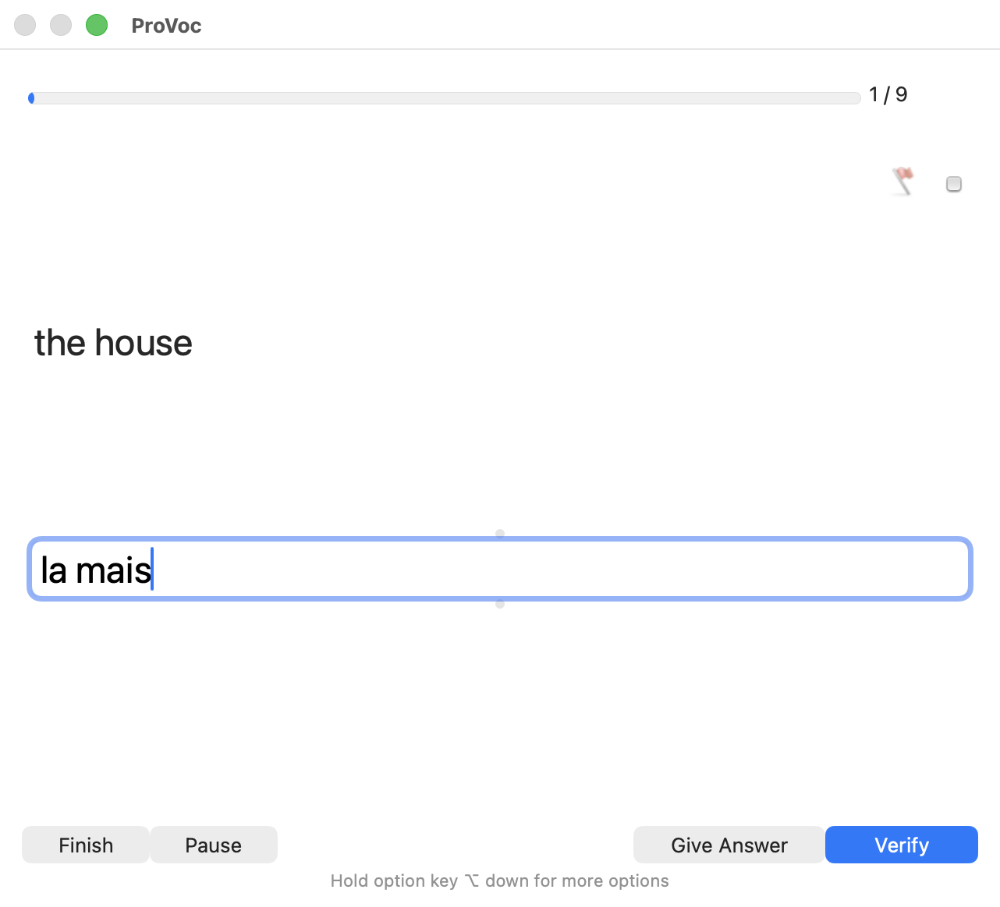
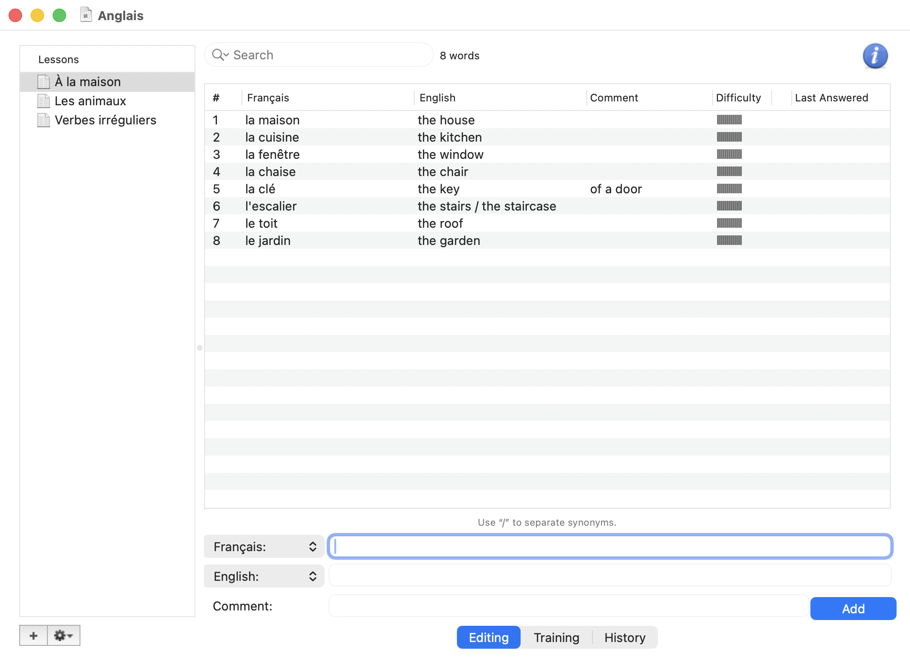
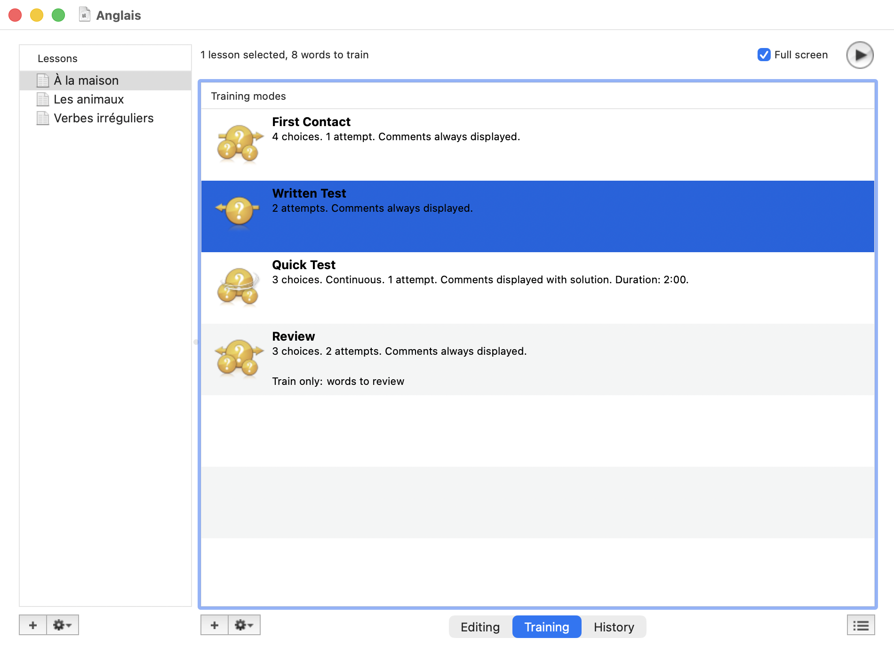
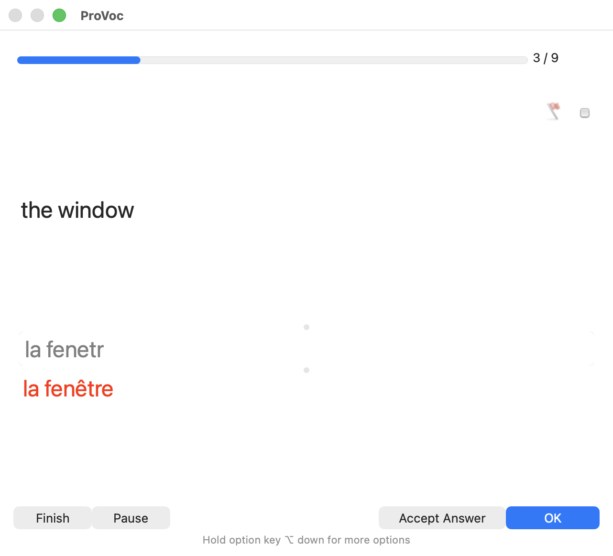
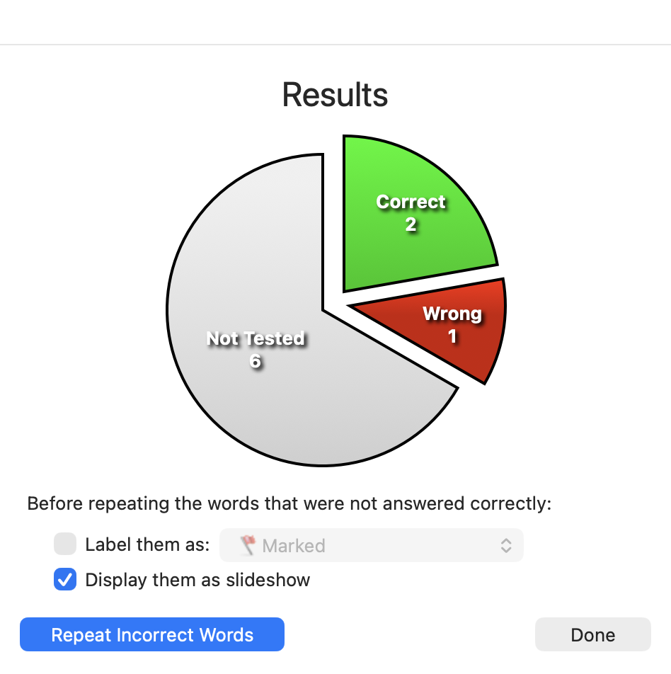

# ProVoc

[](https://github.com/PABannier/ProVoc/actions/workflows/ci.yml)
[](https://github.com/PABannier/ProVoc/releases/latest)

[](LICENSE)

**The Mac vocabulary trainer, rebuilt to run natively on Apple Silicon.**

ProVoc was written by Arizona Software. This repository is an
unofficial revival: their source code, repaired and recompiled for arm64, so that the
application runs on the Macs sold today. I did not write ProVoc and I am not selling
anything. I wanted my vocabulary trainer back.

[Download](#download) · [Why it had to be rebuilt](#why-it-had-to-be-rebuilt) · [Why I prefer it to Anki](#why-i-prefer-it-to-anki) · [Licence and disclaimer](#licence-and-disclaimer)

<p align="center">
  
</p>

## Why it had to be rebuilt

The last version of ProVoc, 4.2.3, was compiled for PowerPC and 32-bit Intel
processors. No current Mac can run it:

- macOS 10.15 (2019) removed support for 32-bit applications.
- Apple Silicon Macs (2020 and later) run arm64 code, and Rosetta 2 only translates
  64-bit Intel code. There is nothing left that can execute the 2008 binary.

Arizona Software published the source when they stopped working on ProVoc, but the
source did not build either. It depended on QuickTime and QTKit, on Carbon calls and on
two prebuilt frameworks, none of which exist for arm64, and it assumed a 32-bit world
throughout. A fork from 2013 had started to modernise the code and left it, by its own
description, unstable: saving, undo and copy and paste raised exceptions, and parts of
the interface no longer refreshed.

So the application was rebuilt. The aim was restoration, not redesign:

- **Same application.** The original Interface Builder nibs, the original shortcuts,
  the original file format. Existing decks open as they are, including the old flat
  `.provoc` files.
- **Native arm64**, for macOS 13 and later. QuickTime became AVFoundation, the sound
  recorder and the camera were rewritten, the Spotlight importer too.
- **The keyboard flow works again.** Type the answer, Return checks it, Return moves
  on. The answer field never loses the focus, dead keys compose (`^` then `e` gives
  `ê`), and no keystroke is lost when you type ahead.
- **Bugs that only show on a current macOS are fixed**: crashes while drawing or
  printing, labels cut short by the new system font, a corrupt deck that opened as an
  empty document ready to be saved over the file.

[`verification/report.md`](verification/report.md) lists everything that was broken,
why, and what was done about it.

## Why I prefer it to Anki

Anki is the obvious alternative, and it is excellent software. For learning the
vocabulary of a language I still prefer ProVoc, for four reasons.

**It makes me type the answer, and it checks it.** In Anki you recall the answer, flip
the card and grade yourself; a card can ask you to type, but you still decide whether
you were right. ProVoc decides. It knows that `the stairs / the staircase` are two
accepted answers and that a part in parentheses is optional, and each language says
whether case, accents, punctuation and spaces count. A wrong answer shakes the window
and you type again; after the allowed tries it shows the solution.

**It is driven entirely from the keyboard.** Type, Return, type, Return. No mouse, no
grading buttons, nothing to aim at. A session of fifty words is fifty answers and fifty
Returns.

**It follows lessons, not a queue.** Words live in lessons and chapters, like the
textbook they come from, and I choose what to train and how: a first contact with
multiple choice, a written test, a timed quick test, a review of the words that are
due, or a mode of my own (direction, number of tries, until learned, only the flagged
words). Anki's scheduler decides each day what I see; here I decide.

**It is a small, native Mac application.** One document per vocabulary, with its words,
sounds and pictures inside. No account, no sync service, no add-ons to configure.

This is a preference, not a verdict. If you want your cards on your phone, shared decks,
or to learn anything other than vocabulary, Anki is the better tool.

<table>
  <tr>
    <td></td>
    <td></td>
  </tr>
  <tr>
    <td align="center">Lessons and words</td>
    <td align="center">Training modes</td>
  </tr>
  <tr>
    <td></td>
    <td></td>
  </tr>
  <tr>
    <td align="center">A wrong answer, and the solution</td>
    <td align="center">Results, and "Repeat Incorrect Words"</td>
  </tr>
</table>

## Download

Get `ProVoc-<version>-arm64.dmg` from the
[latest release](https://github.com/PABannier/ProVoc/releases/latest), open it and drag
ProVoc onto the Applications folder. It needs an Apple Silicon Mac and macOS 13 or later.

The application is not notarized by Apple (it is signed "ad hoc"), so macOS refuses to
open it the first time. Open System Settings > Privacy & Security, scroll down to the
message about ProVoc and click **Open Anyway**. Or, in Terminal:

```bash
xattr -dr com.apple.quarantine /Applications/ProVoc.app
```

## A test with the keyboard only

| Key | What it does |
|---|---|
| ⌥⌘2, then ↑ / ↓ | Show the Training view and choose a training mode |
| ⌘R | Start the test; the answer field has the focus |
| Return | Check the answer. Right: next word. Wrong: the window shakes, type again |
| Y / N | Once the solution is shown: count the answer right after all, or wrong |
| ⌘G, ⌘A | Give the solution, accept my answer |
| ⇧⌘F, ⌘0…⌘9 | Flag the word, label it |
| ⌘K, ⌘L, ⌘B, ⌘E | Sound of the question, sound of the answer, picture, movie (also F1…F4) |
| ⌘P, ⌘R | Pause, resume |
| Esc, ⌥Esc | Finish and show the results, abort at once |
| 1…9, ↑ / ↓, Return | Multiple choice: choose, move, verify |
| ⇧⌘R | Slideshow (→ next, ← previous, Space play / pause, Esc exit) |

## Building from source

The Xcode project in the repository is enough. It is built and tested with Xcode 26:

```bash
git clone https://github.com/PABannier/ProVoc.git
cd ProVoc
xcodebuild -project ProVoc.xcodeproj -scheme ProVoc -configuration Release -derivedDataPath build/DerivedData build
open build/DerivedData/Build/Products/Release/ProVoc.app
```

`ProVoc.xcodeproj` is generated from `project.yml` by [XcodeGen](https://github.com/yonaskolb/XcodeGen);
regenerate it with `xcodegen generate` after adding or removing files. The code is still
manual reference counting, as in 2008.

A release is made by publishing it on GitHub: the Release workflow builds the tag and
attaches the disk image. A tag that is a version number (`v4.3`) becomes the version of
the application.

## How it was checked

[`FEATURES.md`](FEATURES.md) lists 157 features, each with the automated test that
covers it. The tests drive the real application: 143 run inside it and post key and
mouse events to its event queue, 22 scenarios launch it the way the Finder does, and
two scripts drive it from outside, one through AppleScript and one with keys pressed by
macOS itself. `scripts/verify.sh` runs the suites twice, builds `dist/ProVoc.app` and
writes the report:

```bash
scripts/verify.sh
```

It types and clicks in the application for about forty minutes and needs three things a
person has to grant once: the microphone and the camera for ProVoc, and the Accessibility
permission for the terminal. It also trains on copies of real decks, which are not in
this repository: put a few `.pvoc` documents in `fixtures/user-decks/`, or run
`PV_USER_DECKS=<folder of decks> scripts/verify.sh`. The CI on GitHub builds the
application and runs the tests that need neither the keyboard nor a permission.

## Limits

- Apple Silicon only. It is built for macOS 13 and later, and tested on macOS 26.
- Light appearance only: the interface of 2008 stays light when the system is dark.
- Some features lost what they depended on and say so instead of failing: sending notes
  to an iPod, checking for updates, the vocabulary sharing site of Arizona Software, the
  Dashboard widget. The report says what replaces each one.
- No iPhone application and no sync.
- The Spotlight importer was rewritten and is tested by loading it directly; I have not
  yet seen Spotlight itself index a deck with it.

## Licence and disclaimer

ProVoc is © 2008 Arizona Software. They released its source code under the BSD licence
reproduced in [`LICENSE`](LICENSE); their original note to developers is in
[`IMPORTANT README.txt`](IMPORTANT%20README.txt).

I hold no rights over the original code. This project is not affiliated with, endorsed
by or supported by Arizona Software, and the name ProVoc and its artwork remain theirs.
The changes made in this fork are published under the same BSD licence. The software is
provided as is, without warranty of any kind; see the licence.

## Credits

- **Arizona Software** wrote ProVoc and published its source.
- **Mike Holman** started the 2013 fork ([mikecsh/ProVoc](https://github.com/mikecsh/ProVoc)) that this one continues.
- The arm64 revival was done in 2026 by Pierre-Antoine Bannier with [Claude Code](https://claude.com/claude-code).
